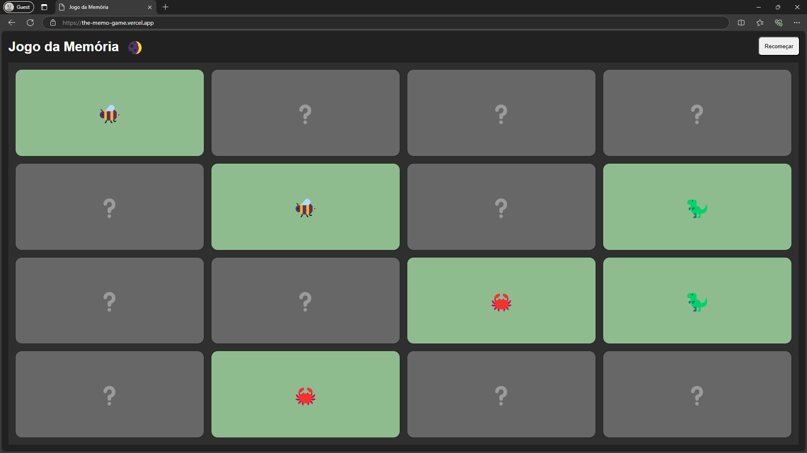

# Jogo da Memória

https://the-memo-game.vercel.app/



## Descrição

Este é um aplicativo de **React puro**, desenvolvido do zero como parte de um curso para ensinar os conceitos fundamentais do React. O projeto utiliza **Webpack** e **Babel** para a configuração do ambiente.

## Funcionalidade

O aplicativo é um jogo da memória simples, no qual os jogadores precisam combinar pares de cartas. Ele foi desenvolvido com o objetivo de demonstrar os conceitos essenciais do React, como:

- Componentização
- Gerenciamento de estado
- Ciclo de vida dos componentes
- Renderização condicional
- ...

## Pré-requisitos

Certifique-se de ter o **Node.js** e o **npm** instalados na sua máquina.

## Comandos para execução

1. Instale as dependências do projeto:
   ```
   npm install
   ```

2. Inicie o servidor de desenvolvimento:
   ```
   npm start
   ```

3. Para criar um build de produção na pasta `./dist`:
   ```
   npm run build
   ```

## Estrutura do Projeto

- **`src/`**: Código-fonte do aplicativo.
- **`dist/`**: Diretório onde o build de produção será gerado.

Desenvolvido para ensinar de forma prática os conceitos de React em um ambiente configurado do zero!

| [](https://github.com/sergiocabral) |
| :-: |
|[sergiocabral.dev](https://sergiocabral.dev)|
